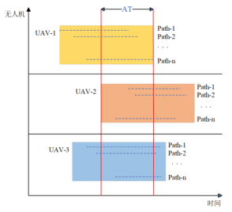
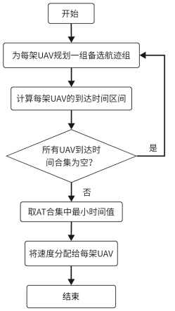
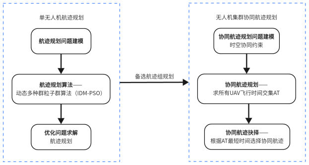
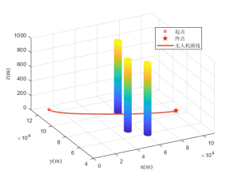
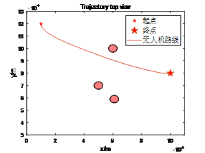
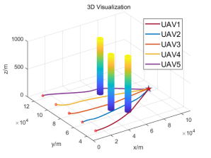
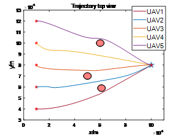
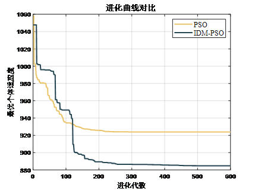

# 基于改进粒子群算法的多无人机协同航迹规划——Uav-track-collaborative-planning-based-on-pso-algorithm

## 1 引言

&emsp;&emsp;在合理分配无人机集群的攻击目标后，需进行满足约束条件的无人机航迹规划，以实现对敌打击任务的顺利执行。无人机集群协同航迹规划通过规划集群的最优航迹，协调多种类型的多架无人机，在同一时刻到达目标，提高无人机的整体突防能力，实现饱和攻击。粒子群算法在适应性、可扩展性、全局寻优和并行处理等方面展现出了卓越的性能，因而被广泛应用于路径规划研究领域。本文采用改进粒子群算法对无人机集群协同航迹进行规划，最后通过仿真实验验证算法的可行性和有效性。

## 2 基于改进粒子群协同航迹规划问题建模

&emsp;&emsp;无人机集群协同航迹规划即规划无人机集群从起始点到目标点的合理轨迹，保证集群在飞行的过程中能够规避威胁区（例如地形威胁、气象威胁等等），同时集群在飞行的过程中要保持协同，能够同时抵达目标点。这可以看作求解一个多约束条件的函数最优问题。

### 2.1 优化指标
&emsp;&emsp;（1）航迹长度代价 
&emsp;&emsp;无人机飞行过程的油耗与飞行的长度距离有一定的关系，将最小化航迹长度作为优化指标，所以第架无人机的航迹长度代价可表示为下式： 

$$J_{i,1}=\sum_{j=1}^n\left|\left|P_{i,j},P_{i,j+1}\right|\right|,j=1,2,\ldots,n  \tag{1}$$

其中， $P_{j}$ 表示无人机飞行轨迹中的航迹节点，无人机的航迹是由个 $n$ 航迹节点 $P_{j}$ 构成的，通过对航迹点、起始点和目标点的连接，即可得到一条无人机的可飞路径 $\\{S_i,P_{i,1},\ldots,P_{i,n},E_i\\}$ ，每个航迹节点可以表示为 $P_{i,j}=\left(x_{i,j},y_{i,j},z_{i,j}\right)$ ， $\left|\left|...\right|\right|$ 表示求两点间的距离。 
&emsp;&emsp;（2）威胁代价 
&emsp;&emsp;除了航迹长度最优之外，规划的轨迹还须要确保无人机飞行过程中的安全。在作战空间中，存在威胁区域，这些区域会损伤无人机，使得无人机不能有效打击敌方目标点。 
&emsp;&emsp;考虑到威胁区建模的复杂性和获取真实数据的困难性，本文对威胁环境进行了抽象化处理，将威胁区域抽象为一个半径为定值的圆柱体，威胁区域的作用半径等同于圆柱体的半径。假设有 $M$ 个威胁区，为使无人机能成功避开威胁区域以实现对敌的有效打击，定义如下威胁代价： 

$$
\begin{cases}
J_{i,2}=\sum_{j=1}^{n}\sum_{m=1}^{M}T_m\big(P_{i,j}\big)\\
d_m=\left\|P_{i,j},Rhreat_m\right\|\\
T_m\big(P_{i,j}\big)=\begin{cases}
0,d_m>D+R_m\\
\infty,d_m\leq D+R_m\end{cases}\\
j=1,2,\ldots,n;m=1,2,\ldots,M
\end{cases} \tag{2}$$

&emsp;&emsp;当无人机在威胁区以外飞行时，其威胁代价为零；当无人机进入威胁区域时，无人机具有很大的毁坏可能性，此时设定该路径的威胁代价为无穷。 
&emsp;&emsp;（3）飞行高度代价 
&emsp;&emsp;为了满足无人机飞行过程中安全性和隐蔽性的要求，同时减小被雷达探测的概率，采用低空飞行策略，这要求了无人机飞行过程中不能有剧烈的高度变化，同时，频繁的飞行高度变换还会增加能源的消耗。因此，定义下式高度代价函数：

$$J_{i,3}=\sum_{j=1}^{n-1}\left|\Delta z_j\right| \tag{3}$$

其中， $\Delta z_{j}$ 为前后两个航迹点的高度差。 
&emsp;&emsp;（4）总体代价函数 
&emsp;&emsp;综合前三小节提出的的路航迹度代价、威胁代价和高度代价，可将无人机三维路径规划的代价函数定义为下式：

$$minJ_i=\alpha_1J_{i,1}+\alpha_2J_{i,2}+\alpha_3J_{i,3} \tag{4}$$

其中， $\alpha_1,\alpha_2,\alpha_3$ 其为权重系数，且满足和为1。

### 2.2 约束条件
&emsp;&emsp;（1）飞行高度约束 
&emsp;&emsp;为避免无人机飞行过程中被敌军发现，本文的无人机集群采用低空飞行策略，所以需要对无人机的飞行高度加以限制。

$$h_{\min}\leq z_{i}\leq h_{\max} \tag{5}$$

其中， $h_{\min}$ 为最低飞行高度， $h_{\max}$ 为最高飞行高度。 
&emsp;&emsp;（2）偏航转角约束 
&emsp;&emsp;受无人机自身机械性能的限制，其偏航转角应在自身允许的最大范围内：

$$
\begin{matrix}
\beta_{\min}\leq arccos\biggl\lfloor\frac{f_{1}}{f_{2}}\biggr\rfloor\leq\beta_{\max} \\
f_{1}=(x_{i}-x_{i-1})(x_{i+1}-x_{i})+(y_{i}-y_{i-1})(y_{i+1}-y_{i}) \\
f_{2}=\sqrt{\left(x_{i}-x_{i-1}\right)^{2}+\left(y_{i}-y_{i-1}\right)^{2}}\cdot\sqrt{\left(x_{i}-x_{i+1}\right)^{2}+\left(y_{i}-y_{i+1}\right)^{2}} 
\end{matrix} \tag{6}$$

其中， $\beta_{\min}$ 为最小偏航转角， $\beta_{\max}$ 为最大偏航转角。 
&emsp;&emsp;（3）俯仰转角约束 
&emsp;&emsp;受无人机自身机械性能的限制，其偏航转角应在自身允许的最大范围内： 

$$\mu_{\min}\leq\arctan\biggl[\frac{\left|z_i-z_{i-1}\right|}{\sqrt{\left(x_i-x_{i-1}\right)^2+\left(y_i-y_{i-1}\right)^2}}\biggr]\leq\mu_{\max} \tag{7}$$

其中， $\mu_{\min}$ 为最小俯仰转角， $\mu_{\max}$ 为最大俯仰转角。
### 2.3&emsp;协同约束
&emsp;&emsp;（1）时间协同约束 
&emsp;&emsp;时间协同约束具体是指在无人机集群航迹规划过程中，为实现对敌的饱和打击，合理协调每架无人机在任务周期内的飞行时间，以实现无人机同时到达目标点对敌方进行打击，因此需要对无人机的到达时间（Arrival Time, AT）进行约束。 
&emsp;&emsp;以三架无人机为例，如图1所示，红色线条之间的部分即为无人机到达目标的时间交集AT。 

    
    
图1&emsp;到达时间交集

&emsp;&emsp;设第 $i$ 架无人机的速度为 $v_{i}\in\left[v_{min},v_{max}\right]$ ，每架无人机均提前生成 $k$ 条备选航迹，第 $j$ 条备选航迹的长度记作 $l_{i,j}$ ，则第 $i$ 架无人机到达目标点的时间区间为 $AT_{i,j}=\[ l_{i,j}/\nu_{max},l_{i,j}/\nu_{min} \]$ ，到达目标点的总时间区间为： 

$$AT_{i,j}=AT_{i,1}\cup AT_{i,2}\cup\cdots\cup AT_{i,k} \tag{8}$$

所以，时间协同为： 

$$
\begin{matrix}
AT=\bigcap_{i=1}^{uavn}AT_i\\
C_t=\begin{cases}
0,&AT\neq\phi\\
1,&AT=\phi
\end{cases}
\end{matrix} \tag{9}$$

其中， $uav\\_num$ 为无人机数量。 
&emsp;&emsp;（2）空间协同约束 
&emsp;&emsp;在无人机集群飞行的过程中，需考虑各无人机之间的通信交互，任意两机间需满足设置的通信范围。且出于安全的考虑，必须考虑各无人机之间实时的最小距离。因此，设置两机间能够通信的最大通信距离和最小防碰撞距离约束。 

$$
\begin{matrix}
D_s\leq d_{i,j}\leq D_c \\ 
C_{s}=\begin{cases}
0,&\text{满足约束}\\
1,&\text{不满足约束}
\end{cases}
\end{matrix} \tag{10}$$

其中， $d_{i,j}$ 为第 $i$ 架无人机和第 $j$ 架无人机间的距离。
## 3&emsp;基于动态多种群粒子群算法求解航迹协同问题
### 3.1&emsp;标准粒子群优化算法原理介绍
&emsp;&emsp;粒子群算法（Particle Swarm Optimization，PSO）作为一种高效的全局寻优算法，已广泛应用于各类实际问题中。PSO的概念源自于模拟鸟群在特定区域内寻找食物的行为，PSO将优化问题抽象为一种群体智能行为，假设在特定区域内存在食物，而群体中的个体并不知道食物的确切位置，个体之间可以进行信息交流，根据自身的适应度评价来感知自身与食物位置的距离，并通过搜寻当前区域内适应值最高的个体周围来寻找食物。 
&emsp;&emsp;粒子群优化算法中，每个粒子代表一个解，在 $D$ 维搜索空间中，第 $i$ 个粒子位置向量为 $x_{i}=(x_{i1},x_{i2},\ldots,x_{iD})$ ，第 $i$ 个粒子速度向量为 $v_{i}=(v_{il},v_{i2},\ldots,v_{iD})$ ，经过 $t+1$ 次迭代后，粒子 $x_{i}$ 历史最佳位置为 $p_{i,best}^{t}$ ,种群全局最佳位置为 $g_{best}^{t}$ 。具体的更新方式为： 

$$
\begin{matrix}
\begin{cases}
v_{i}^{t+l}=\omega\cdot v_{i}^{t}+c_{1}r_{1}\Big(p_{i,best}-x_{i}\Big)+c_{2}r_{2}\Big(g_{best}-x_{i}\Big)\\
\omega=\omega_{max}-t\cdot\Bigg(\frac{\omega_{max}-\omega_{min}}{t_{max}}\Bigg)\\
x_{i}^{t+1}=x_{i}^{t}+v_{i}^{t+l}\end{cases}\\
i=1,2,\ldots,M;t\leq t_{\max}-1
\end{matrix} \tag{11}$$

其中， $\omega$ 为惯性权重，是一个线性下降的非负数，当 $\omega$ 较大时，全局搜索能力较强；当 $\omega$ 较小时，局部寻优能力较强。 $\omega_{max}$ 是初始惯性权重， $\omega_{min}$ 是迭代至最大时的惯性权重，一般设置为 $\omega_{max}=0.9,\omega_{min}=0.4$；$c_{1}$ 和 $c_{2}$ 分别是自身学习因子和全局学习因子， $r_{1}$ 和 $r_{2}$ 是 $\text{(0,1)}$ 区间内的随机数且均匀分布， $M$ 是种群规模（即种群中包含的粒子数）， $D$ 是粒子的维数， $t_{max}$ 是粒子的最大迭代次数。 
&emsp;&emsp;解空间是有边界的，因此粒子的位置和速度都只能在一定范围内，当粒子的速度和位置超出边界时，速度和位置进行限制：

$$
\begin{cases}
\text{if}\left(\nu_i>\nu_{max}\right),\nu_i=\nu_{max} \\
\text{if}\left(\nu_i<\nu_{min}\right),\nu_i=\nu_{min} \\
\text{if}\left(x_i>x_{max}\right),x_i=x_{max} \\
\text{if}\left(x_i<x_{min}\right),x_i=x_{min}\end{cases} \tag{12}$$

&emsp;&emsp;PSO算法在解决一些复杂优化问题时，也会像其它算法一样，存在难以摆脱局部最优、执行效率低、全局搜索能力和局部搜索能力难以平衡等缺陷。 
&emsp;&emsp;为解决这些问题，本文引入动态多种群粒子群算法，即将整个种群分为多个子种群，然后通过设计子种群间的信息交互机制来使多个子种群能在并行化执行的同时使算法的性能得到提升，这种并行化策略又称为多种群策略。
### 3.2&emsp;动态多种群粒子群算法
&emsp;&emsp;动态多种群粒子群算法按适应度值中位值划分种群，并动态调整。适应度值小的为“顶层粒子”，大的为“底层粒子”。从这两类粒子中抽取同等数量的粒子组成局部PSO模型，确保三个种群规模均衡。这三个种群分别为“优势群”、“混合群”和“劣势群”。 
&emsp;&emsp;在优化中，“优势群”粒子适应度低，是种群最优解位置信息，应减小搜索步长进行精细搜索；“劣势群”粒子应增大搜索步长，逐步趋近全局最优解并探寻更优解，提升开采效率；局部模型的“混合群”则涵盖了表现优异与表现欠佳的粒子，通过动态调整其学习率，既有效吸收个体层面的成功经验，又要实现全局信息的共享与交流。
#### 3.2.1&emsp;优势群粒子更新策略
&emsp;&emsp;粒子群算法在优化后期收敛速度变缓的主要原因是其难以摆脱当前局部极值，导致精度下降。为增强优势群跳出局部最优的能力，引入莱维飞行。莱维飞行以大小步间隔形式进行，可以增强粒子活性及跳跃能力，扩大搜索范围，提升多样性，避免陷入局部最优。更新公式如下： 

$$\begin{aligned}&x_{g}^{l}(t)=x_{g}(t)+\alpha\otimes Levy(\lambda)\\&Levy(\lambda)=\frac{\mu}{|\upsilon|^{\frac{1}{\chi}}}\end{aligned} \tag{13}$$

其中， $x_{g}(t)$ 和 $x_{g}^{l}(t)$ 分别为第 $t$ 次迭代时，经莱维飞行更新前后的粒子位置， $\alpha$ 为步长控制因子，一般取0.01，用大小步长飞向原本小概率探索区域，使得搜索区域更加均匀。 $Levy(\lambda)$ 为随机搜索路径， $\otimes$ 代表点乘。 
&emsp;&emsp;莱维飞行有助于粒子摆脱局部最优，但更新位置可能并不更优。本文引入贪婪算法评价策略，仅在更新位置更优时更新，否则保留原位置。实现过程如下： 

$$x_g^{new}(t)=\begin{cases}x_g^l(t),f\Big(x_g^l(t)\Big)\leq f\Big(x_g(t)\Big)\\x_g(t),f\Big(x_g^l(t)\Big)>f\Big(x_g(t)\Big)\end{cases} \tag{14}$$

其中， $x_g^{new}(t)$ 为贪婪算法更新后的粒子位置， $f(x)$ 代表粒子适应度函数。
#### 3.2.2&emsp;劣势群粒子更新策略
&emsp;&emsp;在“劣势群”的更新中，引入组合粒子的概念变更传统速度更新的公式，组合粒子记为 $p_{mix}(t)$ ， $p_{mix}(t)$ 的维度值由各粒子历史最优值随机组合而成，如图2所示。由此得到的劣势群位置和速度更新方式为： 

$$\begin{cases}v_i^{t+l}=\omega\cdot v_i^t+c_1r_1\big(p_{i,best}-x_i\big)+c_2r_2\big(g_{best}-x_i\big)+c_3r_3\big(p_{mix}-x_i\big)\\x_i^{t+1}=x_i^t+v_i^{t+l}\end{cases} \tag{15}$$

其中， $c_{3}$ 中为混合学习因子， $r_{3}$ 为 $(0,1)$ 随机数。由式可知，组合粒子由当前个体最优粒子组合而成，既继承了各粒子的优良维度，同时具有随机性，兼顾了粒子多样性和优异性。 
&emsp;&emsp;在“劣势群”中，由于具有保留价值的粒子信息相对较少，种群远离问题的优质解。因此，在更新完成后，本文还引入了高斯变异机制。这种变异机制能够在整个搜索空间中广泛探索各种可能的解区域，从而有效避免过早收敛的情况发生，并进一步增强子种群的多样性。具体的变异过程如下式所示： 

$$\begin{aligned}&if\quad r>\frac{l}{2}\Bigg[1+\arctan\Bigg(\frac{t}{t_{\max}}\Bigg)\times\frac{4}{\pi}\Bigg]:\\&x^{new}=x\times\left(l+N(0,l)\right)\end{aligned} \tag{16}$$

其中， $r$ 和 $N(0,1)$ 是之间的随机数， $x$ 为粒子的位置， $x^{new}$ 为变异后的粒子的位置。 

    
     
    
图2&emsp;组合粒子原理

&emsp;&emsp;通过变异公式可得，当第一个式子成立时，才根据第二式对粒子进行高斯变异操作。随着迭代次数的增加，第一个式子成立的可能性逐渐降低，粒子发生变异的概率也逐步减少。变异操作可在初始阶段使粒子以较大概率发生变异,扩大粒子在解空间中的搜寻范围,保证了粒子群的多样性。
#### 3.2.3&emsp;混合群粒子更新策略
&emsp;&emsp;混合群介于优势群和劣势群之间。由于个体间的差异在算法前期较大，混合群在早期侧重于其认知部分，可以实现多方交流；而在后期，则加强全局极值的引领力，促使粒子向最优解的周围聚集。因此，学习因子引入了余弦和正弦函数，使得自身学习因子单调递减，种群学习因子单调递增。混合群的速度更新公式为： 

$$\begin{aligned}
&\nu_{i}^{t+1}=\omega\cdot\nu_{i}^{t}+2cos\biggl(\frac{\pi t}{2t_{\mathrm{max}}}\biggr)r_{1}\bigl(p_{i,best}-x_{i}\bigr)+2sin\biggl(\frac{\pi t}{2t_{\mathrm{max}}}\biggr)r_{2}\bigl(g_{best}-x_{i}\bigr) \\
&\omega=\omega_{min}+(\omega_{max}-\omega_{min})\mathrm{cos}\biggl(\frac{\pi t}{t_{max}}\biggr)
\end{aligned} \tag{17}$$

&emsp;&emsp;由于惯性权重因子对PSO算法性能有影响，其值较大时利于全局搜索，较小值时利于加快收敛速度，注重局部开发。因此，在搜索初期设置较大权重因子以提升全局搜索能力；在搜索后期，减小权重因子以增强局部开发能力。通过非线性惯性权重平衡种群局部和全局勘探能力。
### 3.3&emsp;基于动态多种群粒子群算法求解航迹规划流程
&emsp;&emsp;1）确定粒子群规模（即粒子数量）、惯性权重初值和终值、认知系数、社会系数等参数值。 
&emsp;&emsp;2）初始化粒子。对粒子群进行初始设置，粒子维度为 $3n$ ，有 $n$ 个航迹点。计算每个粒子的目标函数值，并在当前迭代中比较各个粒子的表现，更新最优值。 
&emsp;&emsp;3）根据适应度排序，划分子种群。计算每个粒子的适应度值，并根据适应度值对粒子进行排序，划分为优势粒子、劣势粒子和混合粒子。 
&emsp;&emsp;4）粒子更新。优势粒子更新：利用传统方式更新优势粒子的位置和速度，引入莱维飞行——贪婪策略进行粒子位置更新；劣势粒子更新：利用含组合粒子的策略更新劣势粒子的位置和速度，并进行高斯变异；混合粒子更新：利用异步学习因子策略更新混合粒子的位置和速度。 
&emsp;&emsp;5）合并和群。将各个子种群进行合并，重新形成新的粒子群。 
&emsp;&emsp;6）判断终止条件。检查是否达到了预设的最大迭代次数或算法精度要求。如果没有达到，返回步骤3），继续迭代。如果达到，则输出当前找到的最优解。 
&emsp;&emsp;算法流程图见图3所示。 

    
     
    
图3&emsp;动态多种群粒子群算法流程图

#### 3.3.1&emsp;航迹平滑
&emsp;&emsp;通过改进的粒子群优化算法对航迹规划模型进行求解，求解结果是一系列满足各种约束的航迹点 $\\{S_i,P_{i,1},\ldots,P_{i,n},E_i\\}$ 。将所有航迹点依次连接可以得到无人机的初始航迹。然而，生成的初始航迹通常是一条连续的折线，并不是平滑的飞行路线。因此，需要对路径进行平滑处理。为优化无人机的飞行航迹，本文利用三次样条插值对初始航迹进行平滑处理。关于三次样条的具体原理本文不过多介绍。 

$$
\begin{matrix}
&\begin{cases}
X\\_seq=spline(linspace(0,1000,k),x\\_seq,linspace(0,1000,1000))\\
Y\\_seq=spline(linspace(0,1000,k),y\\_seq,linspace(0,1000,1000))\\
Z\\_seq=spline(linspace(0,1000,k),z\\_seq,linspace(0,1000,1000))\end{cases} \\
&path=\begin{bmatrix}X\\_seq',Y\\_seq',Z\\_seq'\end{bmatrix}
\end{matrix} \tag{18}$$

其中， $spline( )$ 为三次样条插值函数， $linspace()$ 为生成线性向量函数， $k$ 为原始航迹点的数量， $x\\_seq,y\\_seq,z\\_seq$ 为原始航迹点 $(x,y,z)$ 的向量， $path$ 为平滑后的轨迹。
### 3.4&emsp;基于动态多种群粒子群算法的协同航迹规划
#### 3.4.1&emsp;备选航迹组规划方法
&emsp;&emsp;在3.3节中，基于改进粒子群算法的单无人机航迹规划所得的最优结果虽然能够满足单无人机的各种约束，但在多机协同中并不能满足时间和空间的约束。因此，为了满足时间和空间的约束，应事先为每架无人机设计多条航迹供选择。本节在改进粒子群算法的基础上，通过合理修改参数和约束条件，为无人机规划出多条飞行路线。该方法的主要目的是获得更大范围内的分布航迹，而非全局最优航迹。 
&emsp;&emsp;在备选航迹规划过程中，为无人机群中的 $n$ 架无人机按顺序规划出 $m$ 条飞行路线。为了保障航迹的丰富性，设置最大重复航迹点 $R_{max}$ 。当备选航迹组中某两条航迹的相同航迹点数量大于 $R_{max}$ 时，则重新规划其中一条航迹。此外，还需要确保不同无人机之间的航迹满足式（10）即空间约束，以保证无人机群的整体协调性。 
&emsp;&emsp;备选航迹组规划方法的具体步骤为： 
&emsp;&emsp;1）初始化参数，赋值 $m、n、D_{s}、D_{c}、R_{max}$ 。 
&emsp;&emsp;2）根据3.3节提出的动态多种群粒子群算法规划出第 $i$ 架无人机的航迹。 
&emsp;&emsp;3）当 $i\neq 1$ 时，判断当前UAV与之前 $i-1$ 架UAV之间的距离是否满足式（10）空间约束，满足则继续执行步骤4），反之重新执行步骤2）。 
&emsp;&emsp;4）计算第 $i$ 架UAV当前航迹同之前航迹的重复航迹点个数，若小于 $R_{max}$ 则执行步骤5）并记 $m=m-1$ ，反之重新执行步骤2）。 
&emsp;&emsp;5）计算第 $i$ 架UAV的航迹个数 $m$ ，当 $m=0$ 时，第 $i$ 架无人机的航迹规划结束，并记 $i=i+1$ ，继续执行步骤6），否则重新执行步骤2）。 
&emsp;&emsp;6）当 $i=n$ 时，备选航迹组规划结束并输出结果，反之重新执行步骤2）。
#### 3.4.2&emsp;航迹协同规划流程
&emsp;&emsp;1）为每架UAV规划一组备选航迹。 
&emsp;&emsp;2）计算每架无人机沿着备选航迹飞行时的到达时间区间。 
&emsp;&emsp;3）检查所有无人机的到达时间区间的交集是否为空集。如果交集为空集，表示没有共同的到达时间，需要重新选择航迹，返回步骤1）；如果交集不为空集，继续下一步。 
&emsp;&emsp;4）选择到达时间区间的最小时间集合作为到达时间（AT）。 
&emsp;&emsp;5）根据确定的到达时间（AT），计算每架无人机需要的飞行速度。 
&emsp;&emsp;6）将计算出的飞行速度分配给每架无人机。 
&emsp;&emsp;协同规划流程如图4所示。 

    
     
    
图4&emsp;无人机集群协同航迹规划流程图

#### 3.4.3&emsp;基于动态多种群粒子群算法的无人机集群协同航迹规划总体框架
&emsp;综上所述，基于动态多种群粒子群算法（IDM-PSO）的无人机集群协同航迹规划方法框架如图5所示。 

    
     
    
图5&emsp;无人机集群协同航迹规划整体框架

## 4&emsp;仿真验证
&emsp;&emsp;本节通过单无人机航迹规划和五架无人机协同航迹规划两个案例对3节提出的基于动态多种群粒子群算法航迹规划进行仿真验证。仿真环境为Matlab R2022b，所用笔记本配置为Intel i7-1065G7 3.9GHz CPU处理器，16GB RAM。 
&emsp;&emsp;在所有仿真中，设置空间范围为 $120km*120km*1000m$ 。无人机集群的最大通信距离和最小安全距离分别为 $Ds=100m,Dc=250km$ 。
### 4.1&emsp;案例1：单无人机三个威胁区航迹规划
&emsp;&emsp;无人机由当前初始位置协同，避过三个威胁区，到达目标点对敌进行打击，其初始位置及终端时刻坐标见表1，威胁区信息见表2。 

    <capital>表1&emsp;无人机位置设置</capital>
        <table>
            <tr>
                <td>无人机编号</td> 
                <td>初始坐标（km, km, m）</td> 
                <td>终点坐标（km, km, m）</td> 
            </tr>
            <tr>
                <td>
1
</td>
                <td>
(120,40,50)
</td>
                <td>
(100,80,50)
</td>
            </tr>
        </table>

    <capital>表2&emsp;三威胁区坐标及半径设置</capital>
        <table>
            <tr>
                <td>威胁区编号</td> 
                <td>威胁区坐标（km,km）</td> 
                <td>威胁区半径/km</td> 
            </tr>
            <tr>
                <td>
1
</td>
                <td>
(50,70)
</td>
                <td>
3
</td>
            </tr>
            <tr>
                <td>
2
</td>
                <td>
(61,59)
</td>
                <td>
3
</td>
            </tr>
            <tr>
                <td>
3
</td>
                <td>
(60,100)
</td>
                <td>
3
</td>
            </tr>
        </table>

&emsp;&emsp;单架无人机航迹规划仿真结果如图6所示，可以看出无人机以最短的安全航迹到达目标区域，没有经过威胁区，符合2节中提出的优化指标和约束条件。 

    
    
     
    
图6&emsp;单无人机航迹图

### 4.2&emsp;案例2：五架无人机三个威胁区协同航迹规划
&emsp;&emsp;五架无人机从初始位置，避过三个威胁区，同时到达目标点进行打击，各无人机初始位置及终端时刻坐标见表3，威胁区坐标见表2。无人机速度范围为 $[200,280]m/s$ 。 

    <capital>表3&emsp;五无人机始末位置</capital>
        <table>
            <tr>
                <td>无人机编号</td> 
                <td>初始坐标（km, km, m）</td> 
                <td>终点坐标（km, km, m）</td> 
            </tr>
            <tr>
                <td>
1
</td>
                <td>
(10,40,50)
</td>
                <td>
(101,79,50)
</td>
            </tr>
            <tr>
                <td>
2
</td>
                <td>
(10,60,50)
</td>
                <td>
(100,79,50)
</td>
            </tr>
            <tr>
                <td>
3
</td>
                <td>
(10,80,50)
</td>
                <td>
(100,80,50)
</td>
            </tr>
            <tr>
                <td>
4
</td>
                <td>
(10,100,50)
</td>
                <td>
(100,81,50)
</td>
            </tr>
            <tr>
                <td>
5
</td>
                <td>
(10,120,50)
</td>
                <td>
(101,81,50)
</td>
            </tr>
        </table>

&emsp;&emsp;五架无人机的最优协同轨迹见图7所示，所求轨迹均未穿过威胁区，并且抵达目标点，满足约束条件。图7为3D轨迹视图，图8为俯视图。

    
    
     
    图7&emsp;五架无人机航迹3D视图
    &emsp;&emsp;&emsp;&emsp;&emsp;&emsp;&emsp;&emsp;&emsp;&emsp;
    图8&emsp;航迹俯视图

&emsp;&emsp;表4展示了无人机集群协同航迹规划信息。无人机的航迹长度并非完全为最优航迹，而是综合考虑了作战要求以及时空协同约束后的全局最优结果。通过规划出的协同时间区间，为每架无人机设置相应的飞行速度，从而实现无人机群在同一时刻或规定的时间段内同步到达目标区域。表5所示为给无人机分配的速度。 

    <capital>表4&emsp;无人机集群航迹协同信息</capital>
        <table>
            <tr>
                <td>UAV</td> 
                <td>最优航迹/km</td>
                <td>最差航迹/km</td>
                <td>到达时间区域/s</td>
                <td>协同时间区域/s</td>
            </tr>
            <tr>
                <td>
1
</td>
                <td>
101.48
</td>
                <td>
106.29
</td>
                <td>
[362.42, 531.45]
</td>
                <td rowspan="5">[392.15, 456.70]</td>
            </tr>
            <tr>
                <td>
2
</td>
                <td>
92.38
</td>
                <td>
93.54
</td>
                <td>
[329.92, 467.70]
</td>
            </tr>
            <tr>
                <td>
3
</td>
                <td>
90.11
</td>
                <td>
91.34
</td>
                <td>
[321.82, 456.70]
</td>
            </tr>
            <tr>
                <td>
4
</td>
                <td>
93.35
</td>
                <td>
95.71
</td>
                <td>
[333.39, 478.55]
</td>
            </tr>
            <tr>
                <td>
5
</td>
                <td>
109.80
</td>
                <td>
116.52
</td>
                <td>
[392.15, 582.60]
</td>
            </tr>
        </table>

    <capital>表5&emsp;无人机集群速度分配</capital>
        <table>
            <tr>
                <td>UAV</td> 
                <td>航迹长度/km</td>
                <td>到达时间/s</td>
                <td>速度分配m/s</td>
            </tr>
            <tr>
                <td>
1
</td>
                <td>
101.48
</td>
                <td rowspan="5">392.15</td>
                <td>
258.78
</td>
            </tr>
            <tr>
                <td>
2
</td>
                <td>
93.54
</td>
                <td>
238.53
</td>
            </tr>
            <tr>
                <td>
3
</td>
                <td>
91.34
</td>
                <td>
232.92
</td>
            </tr>
            <tr>
                <td>
4
</td>
                <td>
93.35
</td>
                <td>
238.05
</td>
            </tr>
            <tr>
                <td>
5
</td>
                <td>
109.80
</td>
                <td>
279.99
</td>
            </tr>
        </table>

### 4.3 仿真分析
&emsp;&emsp;通过动态粒子群算法对单架无人机三个威胁区进行了单轨迹仿真和五架无人机三个威胁区的协同航迹规划进行了仿真。结果表明，可以规划出无人机航迹并且成功避开威胁区，协同航迹能够同时到达目标区域对敌进行打击。 
&emsp;&emsp;同时，为了对比改进后的动态多种群粒子群优化算法的高效性，本文在相同种群大小和迭代次数的参数设置下，将改进后的算法与传统算法的迭代适应度变化进行对比分析，如图9所示。可以发现，改进后的粒子群优化算法收敛的适应度为885左右，而传统算法的收敛适应度为924。相比PSO算法，本文提出的IDM-PSO算法能够跳出局部最优解，寻找全局最优解，具有更好的收敛效果和收敛精度。 

    
     
    
图9&emsp;IDM-PSO与PSO迭代适应度变化图

## 5&emsp;小结
&emsp;&emsp;本文建立了单无人机轨迹规划约束模型，设计了相应的目标函数，然后建立了时间和空间协同约束模型。随后，介绍了改进粒子群算法，设计了备选航迹组策略，以解决多无人机的时间协同问题，并给出了多机协同航迹规划解决方案的总体框架。最后，通过仿真验证单无人机航迹规划和多无人机协同航迹规划的结果。结果表明，该方法在满足时空协同约束的条件下，有效地解决了多机航迹规划问题。同时，相较于传统的PSO算法，本文所采用的IDM-PSO算法在收敛速度和解质量方面均展现出显著优势。
