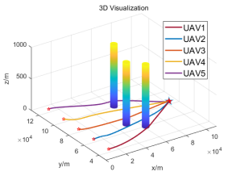

    <h1>基于改进粒子群算法的多无人机协同航迹规划</h1>
    

        <b>简体中文 | <a href="README_en.md">English</b></a>
    

## 1. 摘要
&emsp;&emsp;无人机集群协同航迹规划通过规划集群的最优航迹，协调多种类型的多架无人机，在同一时刻到达目标，提高无人机的整体突防能力，实现饱和攻击。粒子群算法在适应性、可扩展性、全局寻优和并行处理等方面展现出了卓越的性能，因而被广泛应用于路径规划研究领域。本项目采用改进粒子群算法对无人机集群协同航迹进行规划，最后通过仿真实验验证算法的可行性和有效性。 通过动态粒子群算法对单架无人机三个威胁区进行了单轨迹仿真和五架无人机三个威胁区的协同航迹规划进行了仿真。结果表明，可以规划出无人机航迹并且成功避开威胁区，协同航迹能够同时到达目标区域对敌进行打击。 
&emsp;&emsp;这是我们所撰写的专利[3]，里面有具体的实现原理等，感兴趣的朋友可以下载阅读，链接在第四部分参考里。 

## 2. 相关工作
### 2.1 文件结构
&emsp;&emsp;使用 Matlab 实现，PSO_code 文件夹里分三个文件夹 
- PSO multi-population single-track code：为带地形和威胁区，地图大小为[500m，500m，100m]的单架无人机航迹规划
- PSO time coordination code：为带地形和威胁区，地图大小为[500m，500m，100m]的五架无人机的协同航迹规划
- PSO collaboration breakout scenario code：为带威胁区，地图大小为[200km，200km，1000m]的五架无人机的协同航迹规划

### 2.2 部分结果

    <table>
        <tr>
            <td ></td>
            <td ></td>
        </tr>
    </table>
    <table>
        <tr>
            <td >pic.1 单架无人机优化轨迹</td>
        </tr>
    </table>
    <table>
        <tr>
            <td ></td>
            <td ></td>
        </tr>
    </table>
        <table>
        <tr>
            <td >pic.2 五架无人机优化轨迹</td>
        </tr>
    </table>

## 3. 总结
&emsp;&emsp;对于前段时间相关工作的总结，初步完成了基于动态粒子群算法的多无人机轨迹协同优化。但还存在一些问题，比如这些方法为离线优化，即已知环境等信息，实际上更普遍的场景是动态规划，或者说在线规划，边获取环境信息边进行符合约束的最优计算，这要求较高的计算效率；另外一个问题就是，这些规划只是基于位置级的运动规划，还需另外设计控制器进行轨迹跟踪，对于一个完善的规划控制系统这是必需的。 
&emsp;&emsp;基于智能优化算法的轨迹优化研究，我个人认为没有太大的意义，感觉通过最优控制的方法，基于飞行器或者其他被控模型的动力学进行优化更有研究意义一点（纯属个人观点，学识尚浅）。

## 4. 参考
[1] 基于改进粒子群算法的无人机三维路径规划：https://mp.weixin.qq.com/s/cCwPzWwMHF2FBHZJ3fmmtg 
[2] 多无人机协同目标分配与航迹规划方法研究：https://kns.cnki.net/kcms2/article/abstract?v=0-LBHIej7QkK55CbKPr5n2e0vq3JdYPJOg2r-rfaHeL6OcepVqSMU3CmVujbx-ln1SXAQT_xDcFkpgAqAzxFHEAcxugn36JH5p2AufjunIBeSFEI2uKLajzZ_IdA86MouqkV1Zo1N1k8Wjv6gltXVBPy-1ljc4YqHrSGZcvdkzFspDtO9slvu4Ops6KcRfM3&uniplatform=NZKPT&language=CHS 
[3] 基于改进粒子群算法的无人机群协同飞行自主决策方法：https://kns.cnki.net/kcms2/article/abstract?v=-xbefZa1CdsCsbU6YYsDq7-t_zmQjDC8FWyiFJwZRWDc_4MUhhcgMirQSaNa5iocy0wReyIA5NPIkUTnI2FDdRZzSJtECqSZWN3uTpOkt1rMB_1DbRyOTeLDU8J_k9d3pLUx8j-LJ8Z86dNmx2RcqsoyqVUH04PdDPkZXYzLPbUuHdizIJgOjjjfIEg6PH0S&uniplatform=NZKPT&language=CHS 

