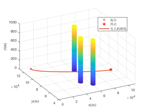
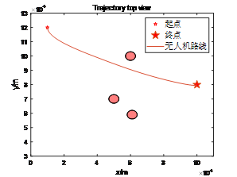
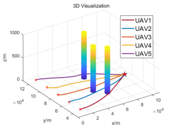
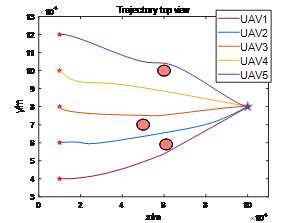

	<h1>Uav-track-collaborative-planning-based-on-pso-algorithm</h1>
	

		<b><a href="README.md">简体中文</a> | English</b>
	

## 1. abstract
&emsp;&emsp;By planning the optimal flight path of the cluster, multiple UAVs of various types can be coordinated to reach the target at the same time, so as to improve the overall penetration capability of UAVs and realize saturation attack. Particle swarm optimization (PSO) is widely used in path planning research because of its excellent performance in adaptability, scalability, global optimization and parallel processing. In this project, the improved particle swarm optimization algorithm is used to plan the cooperative flight path of UAV cluster. Finally, the feasibility and effectiveness of the algorithm are verified by simulation experiments. Dynamic particle swarm optimization (PSO) was used to simulate the three threat zones of a single UAV and the cooperative track planning of three threat zones of five UAVs. The results show that the UAV's flight path can be planned and successfully avoided the threat area, and the cooperative flight path can simultaneously reach the target area to strike the enemy. 

## 2. Related work
### 2.1 File structure
&emsp; &emsp; Using Matlab, PSO_code folder is divided into three folders  
- PSO multi-population single-track code: indicates the flight path planning of a single UAV with terrain and threat area and map size of [500m, 500m, 100m]
- PSO time coordination code: Coordinated flight path planning for five UAVs with terrain and threat area and map size [500m, 500m, 100m]
- PSO collaboration breakout scenario code: Collaborative flight path planning for five UAVs with map size [200km, 200km, 1000m] with threat area

### 2.2 some results

	<table>
		<tr>
			<td ></td>
			<td ></td>
		</tr>
	</table>
	<table>
		<tr>
			<td >pic.1 Optimized trajectory for a single drone</td>
		</tr>
	</table>
	<table>
		<tr>
			<td ></td>
			<td ></td>
		</tr>
	</table>
		<table>
		<tr>
			<td >pic.2 Five drones to optimize trajectories</td>
		</tr>
	</table>

## 3. conclusion
&emsp; &emsp; As for the summary of relevant work in the past few days, the collaborative optimization of multi-UAV trajectory based on dynamic particle swarm optimization algorithm is preliminarily completed. However, there are still some problems. For example, these methods are offline optimization, that is, the known environment and other information. In fact, a more common scenario is dynamic programming, or online programming, where the optimal calculation in line with constraints is carried out while obtaining environmental information, which requires higher computing efficiency. Another problem is that these plans are only motion planning based on the position level, and it is necessary to design additional controllers for trajectory tracking, which is necessary for a perfect planning control system.  
&emsp; &emsp; Personally, I don't think the trajectory optimization research based on intelligent optimization algorithm is of much significance. I feel that optimization based on the dynamics of aircraft or other controlled models through the method of optimal control is of more research significance (purely from my personal point of view, my knowledge is still shallow).

## 4. reference
[1] Uav 3D path planning based on improved particle swarm optimization algorithm：https://mp.weixin.qq.com/s/cCwPzWwMHF2FBHZJ3fmmtg 
[2] Research on cooperative target assignment and track planning of multiple UAVs：https://kns.cnki.net/kcms2/article/abstract?v=0-LBHIej7QkK55CbKPr5n2e0vq3JdYPJOg2r-rfaHeL6OcepVqSMU3CmVujbx-ln1SXAQT_xDcFkpgAqAzxFHEAcxugn36JH5p2AufjunIBeSFEI2uKLajzZ_IdA86MouqkV1Zo1N1k8Wjv6gltXVBPy-1ljc4YqHrSGZcvdkzFspDtO9slvu4Ops6KcRfM3&uniplatform=NZKPT&language=CHS 

